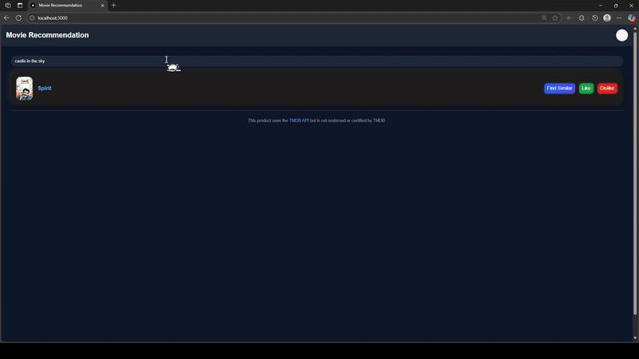

# Movie-Recommendation-System
🧠AI-powered movie recommender that personalizes suggestions based on user taste.

Run with Docker by running 'docker compose up' in the root folder.
Then it will be on localhost port 3000. 

P.S. You will need an api key from TMDB to fetch movie posters.

## 🎬 Demo

[▶️ Watch the full demo video (1:26)](Demo/demo.mp4)
